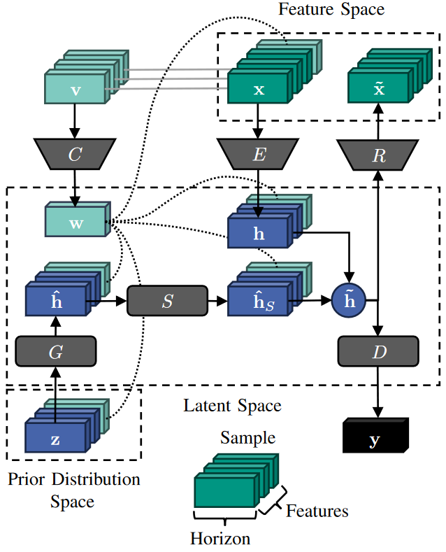

<p float="left">
     
</p>

# Synthesizing Distribution Grid Congestion Data Using Multivariate Conditional Time Series Generative Adversarial Networks

**Authors**: Gökhan Demirel, Jan Hauf, Hallah Butt, Kevin Förderer, Benjamin Schäfer, Veit Hagenmeyer

**Contact**: [goekhan.demirel@kit.edu](mailto:goekhan.demirel@kit.edu)

## Introduction



The Multivariate Conditional Time-series Generative Adversarial Networks (MC-TimeGAN) is a generative model designed to synthesize multivariate conditional time series. It extends the [TimeGAN](https://github.com/jsyoon0823/TimeGAN) framework to generate synthetic time-series data in a conditional manner, focusing on grid congestion multivariate time series for a power distribution grid by modifying labels.

## Compatibility

MC-TimeGAN has been tested and works with the following versions of PyTorch:
- PyTorch version: `2.2.0+cu121` (GPU)
- PyTorch version: `2.3.1+cpu`  (CPU)

## Usage Command Line

Run the MC-TimeGAN training and data generation with default arguments by using the **[__main__.py](__main__.py)** script directly from the command line:
- Example bash script to run **[__main__.py](__main__.py)** with default values
```bash
python __main__.py --data "helper/data/raw/feeder_sgens_4w_data.csv"  --labels "helper/data/raw_labels/feeder_sgens_4w_labels_ordinal.csv"  --horizon 96 --hidden_dim 24 --num_layers 3 --epochs 2000 --batch_size 128 --learning_rate 1e-3 --csv_filename "helper/synthetic_data/main_mctimegan_synthetic_sgen_data.csv"
```
- or outside the MC-TimeGan folder
```bash
python MC-TimeGAN --data "helper/data/raw/feeder_sgens_4w_data.csv"  --labels "helper/dat
a/raw_labels/feeder_sgens_4w_labels_ordinal.csv"  --horizon 96 --hidden_dim 24 --num_layers 3 --epochs 2000 --batch_size 
128 --learning_rate 1e-3 --csv_filename "helper/synthetic_data/main_mctimegan_synthetic_sgen_data.csv"
```

## Arguments:

| Argument                | Type    | Default Value                                         | Help                                  |
|-------------------------|---------|-------------------------------------------------------|---------------------------------------|
| `--data`                | str     | `helper\data\raw\feeder_sgens_4w_data.csv`, `helper\data\raw\feeder_loads_4w_data.csv`          | Path to the data file                 |
| `--labels`              | str     | `helper\data\raw_labels\feeder_sgens_4w_labels_ordinal.csv`, `helper\data\raw_labels\feeder_loads_4w_labels_ordinal.csv` | Path to the labels file               |
| `--horizon`             | int     | `96`                                                  | Horizon for sequence slicing          |
| `--hidden_dim`          | int     | `24`                                                  | Hidden dimension size for the model   |
| `--num_layers`          | int     | `3`                                                   | Number of layers in the model         |
| `--epochs`              | int     | `2000`                                                | Number of training epochs             |
| `--batch_size`          | int     | `128`                                                 | Batch size for training               |
| `--learning_rate`       | float   | `1e-3`                                                | Learning rate for training            |
| `--csv_filename`        | str     | `mctimegan_synthetic_data.csv`                        | Filename for the exported CSV of synthetic data |


## Replicating Results

To replicate the results from the paper, follow these steps:

1. Clone the repository:
    ```bash
    git clone git@github.com:KIT-IAI/MC-TimeGAN.git
    ```
2. Navigate to the cloned directory:
    ```bash
    cd MC-TimeGAN
2. Run the following command to install the packages:
    ```bash
    pip install -r requirements.txt
    ```
4. To train and generate data using the MC-TimeGAN framework, simply run the Jupyter notebook tutorial:
    - **[run_mctimegan_training_and_data_generation_tutorial.ipynb](run_mctimegan_training_and_data_generation_tutorial.ipynb)**
5. For label generation on original data, modification of labels, and comparison between original and synthetic data, run:
    - **[run_mctimegan_label_generation_and_evaluation_tutorial.ipynb](run_mctimegan_label_generation_and_evaluation_tutorial.ipynb)**


## Repository Structure
```plaintext
MC-TimeGAN/
├── __main__.py
├── helper/
│   ├── data/
│   │   ├── modify_labels/
│   │   ├── raw/
│   │   └── raw_labels/
│   ├── img/
│   ├── models/
│   ├── synthetic_data/
│   ├── data_processing.py
│   ├── evaluation_processing.py
│   ├── grid_manager.py
│   ├── label_processing.py
│   ├── mctimegan.py
│   └── metrics.py
├── LICENSE
├── README.md
├── requirements.txt
├── run_mctimegan_label_generation_and_evaluation_tutorial.ipynb
└── run_mctimegan_training_and_data_generation_tutorial.ipynb
```

## License
This code is licensed under the [MIT License](LICENSE).

## Citation 
<!-- If you use this framework or our results in your research, please cite our [paper](https://will be published): -->
If you use this framework in a scientific publication, please cite the corresponding paper:

#### BibTeX format
```tex
@INPROCEEDINGS{demirel_mctimegan_2024,
  author={Demirel, Gökhan and Hauf, Jan and Butt, Hallah and Förderer, Kevin and Schäfer, Benjamin and Hagenmeyer, Veit},
  booktitle={2024 IEEE Sustainable Power and Energy Conference (iSPEC)}, 
  title={Synthesizing Distribution Grid Congestion Data Using Multivariate Conditional Time Series Generative Adversarial Networks}, 
  year={2024},
  month = {11},
  pages={1-6},
  keywords={Deep learning;distribution grid congestion;generative models;multivariate time series;photovoltaic power systems},
  doi={10.1109/iSPEC48194.2024.8974943}}
```

## Contact
For any questions or inquiries, please contact goekhan.demirel@kit.edu.
